# bSafe
Android application that sends an emergency message, along with location to guardians in case of distress.

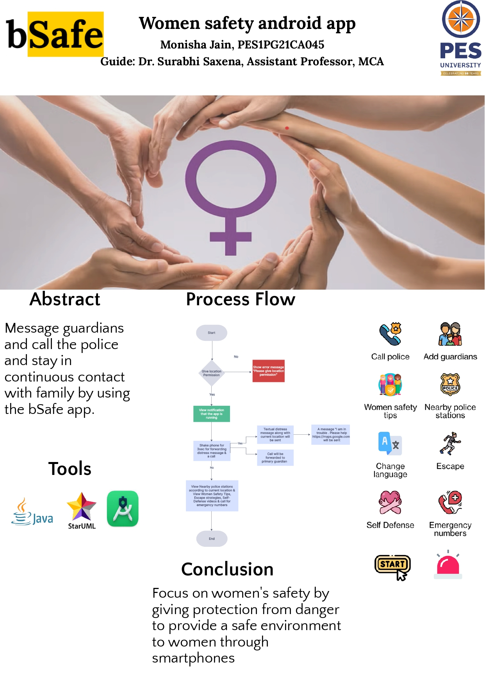

# Demo
 

# Abstract

"bSafe" is a safety application addressing global women's safety concerns, featuring alert messaging, auto-calling, and GPS-based location sharing. Its self-defense and SMS alert functionalities ensure swift aid by notifying guardians and providing nearby police station details.

# Problem 
In today’s world, it is not safe for a person to travel alone at night, especially for
women. Security alert apps on smartphones mitigate risks for solo travelers, especially women, against crimes like robbery and assault, addressing the concerning rise in incidents reported by the National Crime Records Bureau of India.

# Proposed Solution 

This app aims to ensure women's safety via smartphones, recognizing the ubiquity of mobile devices in modern life. Despite legislative efforts following cases like Delhi's Nirbhaya, women's crime rates persist, emphasizing the importance of proactive safety measures over-reliance solely on legal reforms.

# Features of the bSafe Application

1. Finds GPS Location.
2. Shows Notification that the app is running.
3. Message to guardians or closed ones(max 2)
4. Call the primary guardian
5. Call Police directly(100)
6. Find Nearby Police Stations according to the user's current location.
7. Get the Nearby Police Station's phone number and location.
8. Self-defense tips.
9. Escape stratagies.
10. Multiple languages support(English, Hindi, Kannada, Telugu).
11. Self-defense gifs.
12. Emergency Numbers like Women Helpline Number, Ambulance Number etc.

### Features

|               Poster                | Home Page | Nearby Police Stations  |
|:------------------------------------:|:--:| :---: |
|    |  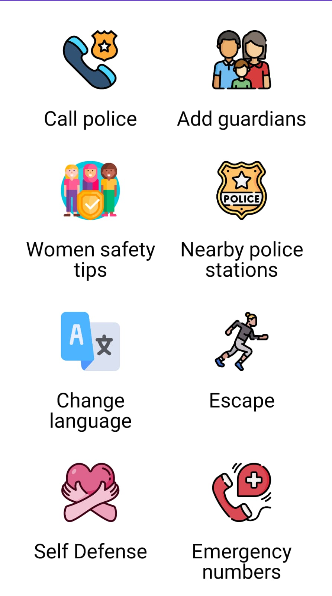| 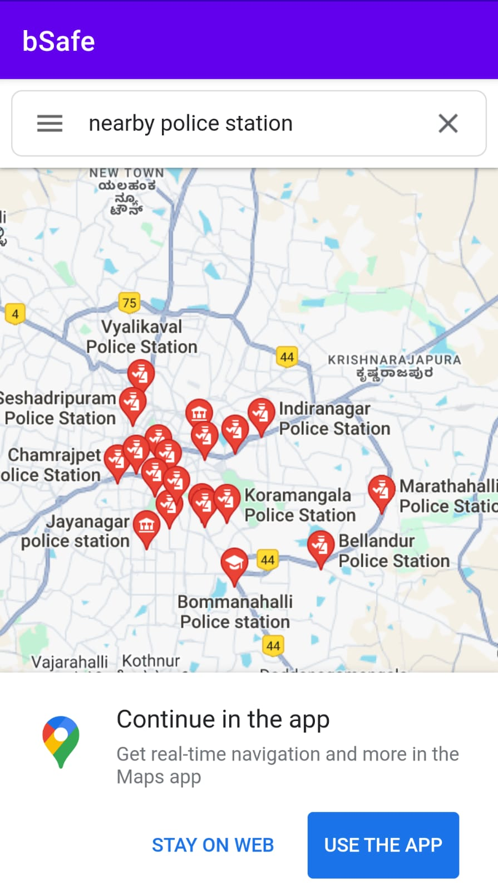|  

|               Add guardians               | Call Police | Emergency Numbers |
|:------------------------------------:|:--:| :---: |
|    |  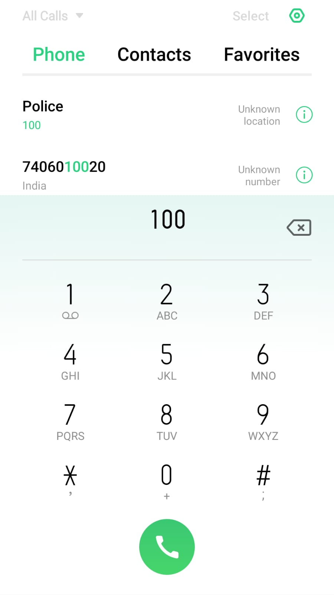| 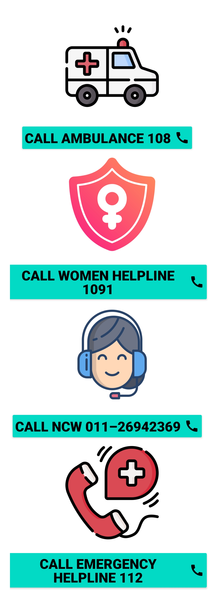|  

|               Self Defense Gif's       | Escape Strategies in English | Escape Strategies in Hindi |
|:------------------------------------:|:--:| :---: |
|  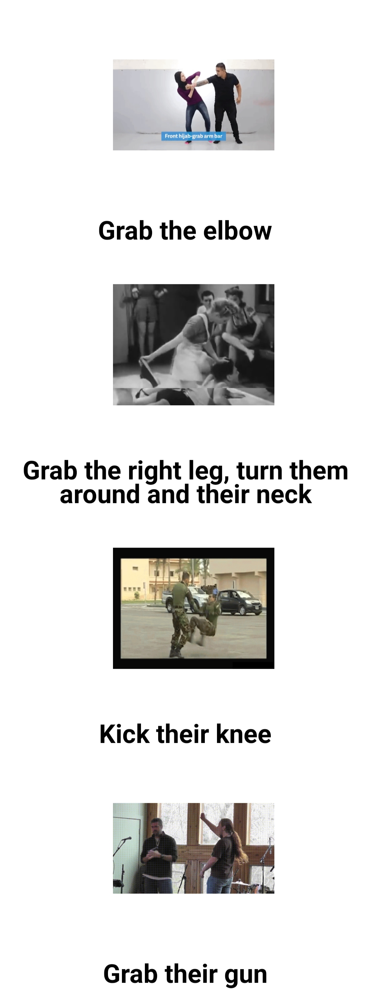  |  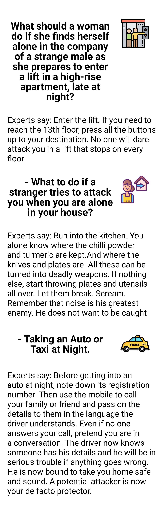| 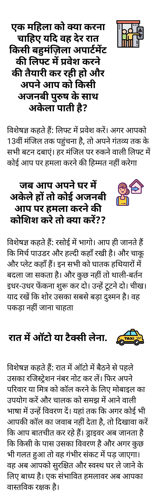| 

|               Nearby Police Stations List| Nearby Police Stations  | Call Police directly|
|:------------------------------------:|:--:| :---: |
|  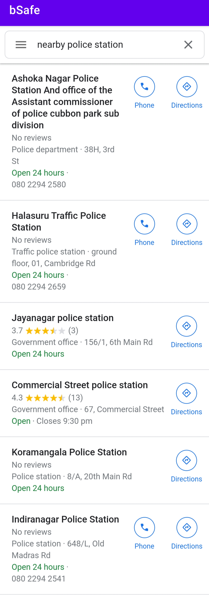  |  | | 

|               Add Guardians| Text Message with current location | Self Defense Tips in English |
|:------------------------------------:|:--:| :---: |
|    |  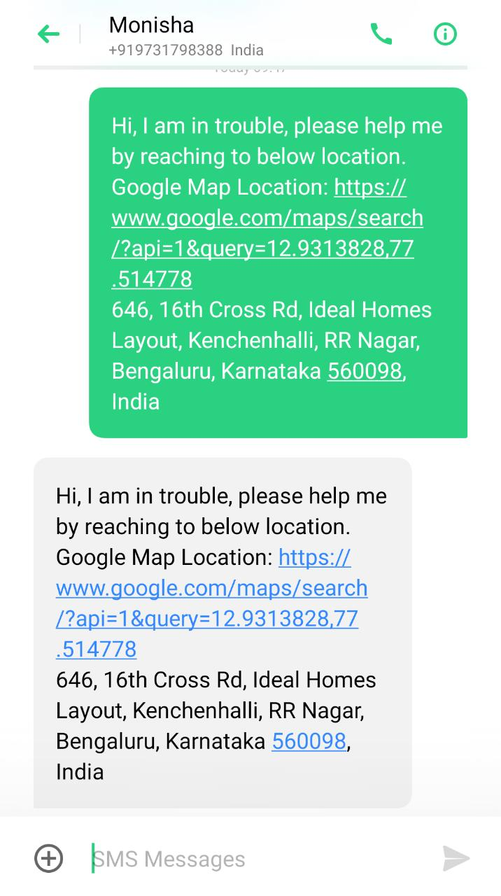| 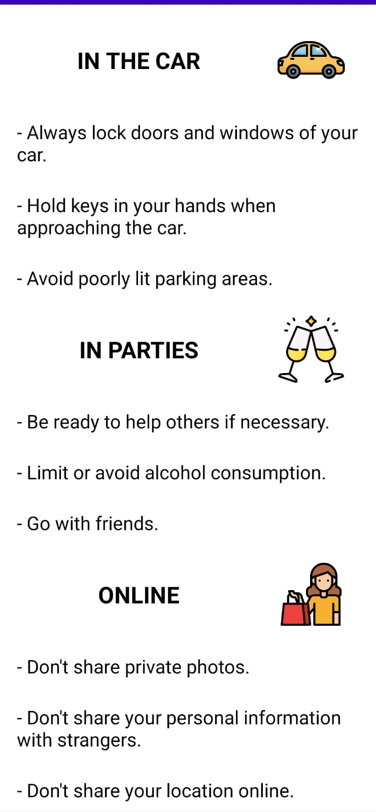| 

|               Self Defense Tips in Kannada| Self Defense Tips in Telugu | Escape Stratagies in Hindi |
|:------------------------------------:|:--:| :---: |
|  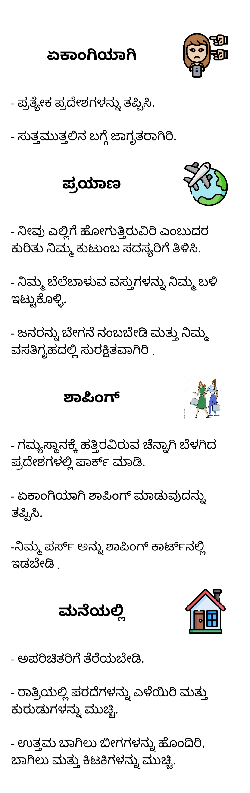  |  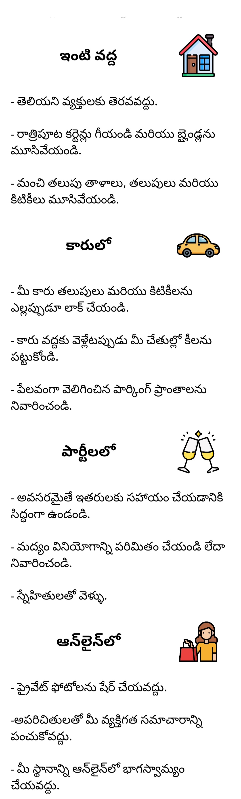| |

# Project Scope

Utilizing Android app development, this application prioritizes women's safety by providing tools to seek assistance in perilous situations, reducing risks and facilitating quick location sharing with trusted contacts for prompt aid.

# Operational Feasibility

1. It works even if the screen is locked.
2. It works even if other apps are being used.
3. This app won’t ask for any specific user details like phone number, or email address.
4. Privacy is more concern as it is a privacy-concern app.
5. Shake detection for calling guardians in case of distress.
6. No changes for other existing applications.
7. Users just need an Android phone, internet connection, and location access to make it operational.

# Hardware Specification

| Specification      | Desired Value |
| ----------- | ----------- |
| Processor      | Intel 13  |
| CPU Speed   | 1GHZ     |
| Memory (RAM)  | 8GB     |
| Hard Disk  | 120GB   |

# Software Specification

| Specification      | Desired Value |
| ----------- | ----------- |
| Operating System     | Windows/Linux/MAC OS  |
| Development Tools  | Android Studio     |
| IDE  | Android Studio     |
| Database   | Not used  |
| Web Server   |  Not used  |
| Web Browser  | Any  |
| Graphics package  | Not used   |
| Software Type  | Java 8 |

# Users
Any User with an Android phone can use it. Here the application is focusing mainly on Women's Safety.
